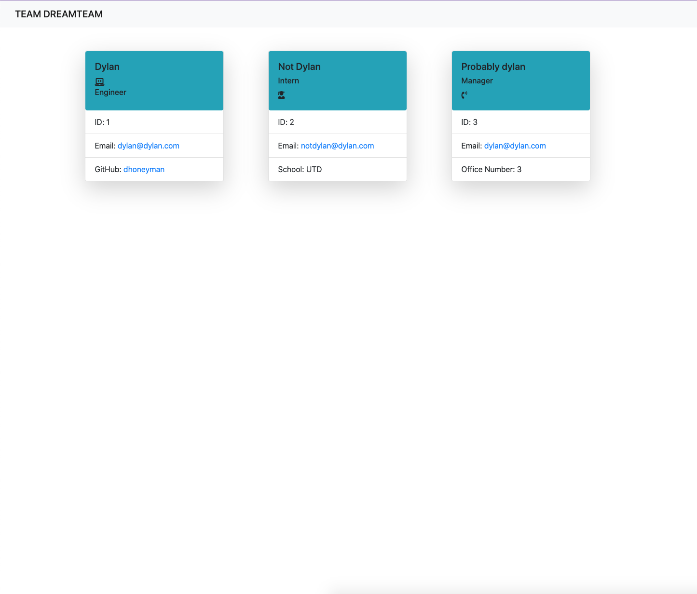

# Team Member Generator
  
## Description
  
  * Motivations - To add new team members to a web page with their relavent information..
  * Reason for building - Because I wanted an easy and streamlined way to create a page for employees.
  * Problem solved - This project gave me a solution to the difficulty that is providing clean employee information.
  * Lessons learned - I learned how to use recursion in command line prompt
  
## Table of Contents
  
 - [Installation](#installation)
 - [Usage](#usage)
 - [License](#license)
 - [Contributing](#Contributing)
 - [Questions](#questions)

## Installation

NA

## Usage

 * simply type 'node index.js' into the command line and run the program and follow the questions asked.
  
  

  
## License
    
 -undefined
 -

## Contributing
  
 * Please visit the [Contributor Covenant](https://www.contributor-covenant.org/) to view our contributors guidelines.

## Questions

 * For questions regarding this software, please reach out to me on [GitHub](https://github.com/dhoneyman)

